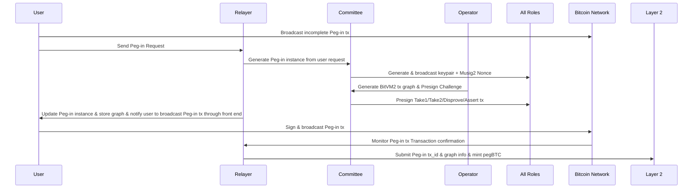
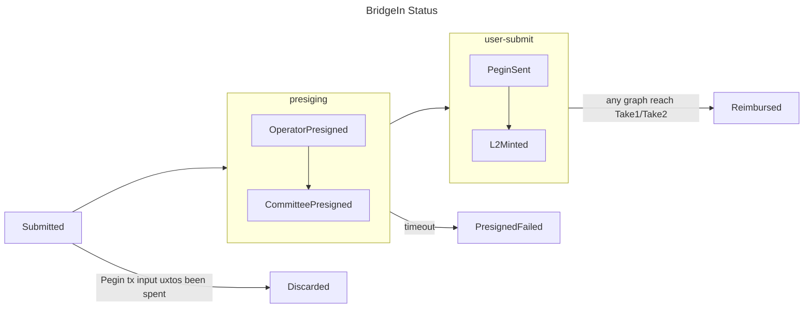
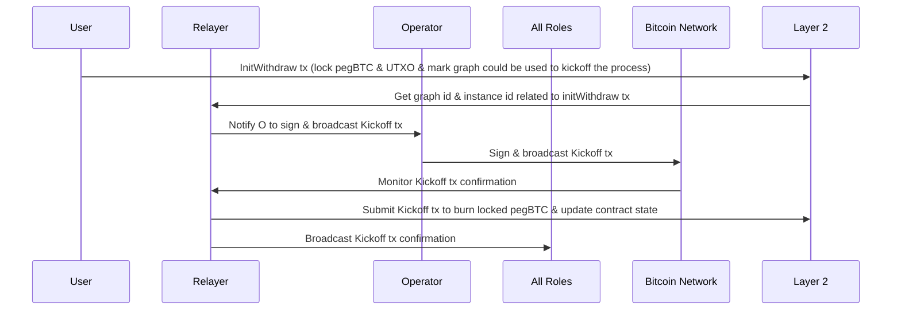
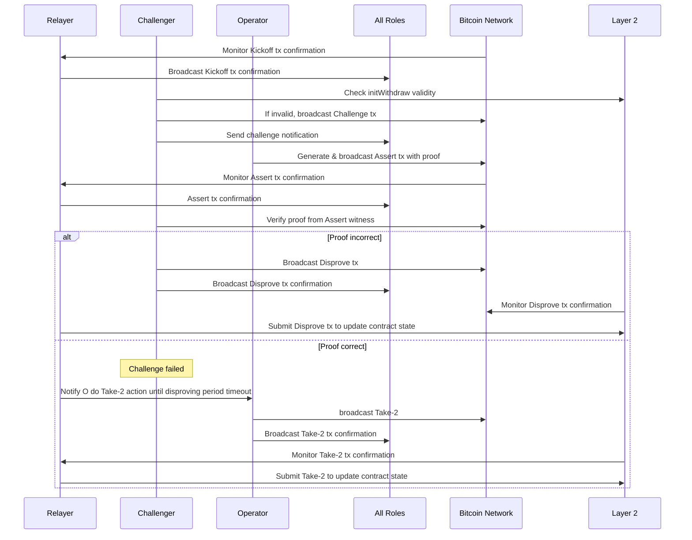
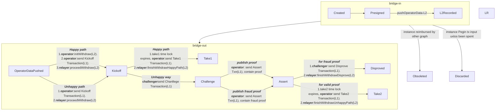

# GOAT Bitvm2 Node

A universal node for Operator, Challenger and Covenant Signer.

## Tutorial

See [Node](node/README.md).

## Roles

There are three main roles in this protocol, Committee, Operator, Challenger and Relayer.

| Role       | Functions                                                                                                                                                                                                                                                                                  |
|------------|--------------------------------------------------------------------------------------------------------------------------------------------------------------------------------------------------------------------------------------------------------------------------------------------|
| Committee  | N-of-n signers for the presign transactions                                                                                                                                                                                                                                                |
| Operator   | Anyone can be an operator. <br>1. Exchange PeggleBTC to native BTC with users <br>2. Kickoff the reimbursement from Committee <br> 3. Generate the preimage of the hash time lock to each watchtower <br>4. Exchange PegBTC to BTC with end-user via AtomicSwap                            |
| Challenger | Anyone can be a challenger <br>1. Verify the valid of the reimbursement from operators offchain <br>2. Submit the challenge transaction on Bitcoin to force the kick off to unhappy path                                                                                                   |
| Watchtower | A special kind of challenger, selected from the Sequencer candidates, maintains the longest chain headers and spends the Watchtower output of the Kickoff transaction.                                                                                                                     |
| Verifier   | Another kind of challenger. Once the kickoff is on the unhappy path, and the operator unveils all the execution trace(Circuit F below), verify finds the flow in the execution trace, and can spend the UTXO from Assert transaction, and stop the operator to continue the reimbursement. |
| Relayer    | Operated by official nodes.<br>1.Provide bootnode services  <br>2 Supports asset transfer services between Layer 1 and Layer 2 of the BTVM2 system, including tracing L1 txn; calling and monitoring L2 gateway contract <br>3 Starting pegin processing.                                  |                                                                    |

## BitVM2 protocol

### BridgeIn

**PegIn**
<!-- https://mermaid.js.org/syntax/stateDiagram.html#state-diagrams -->



**Status**
The status of BridgeIn transitions from start to finish are listed below.
| Status | Description |
|--------------------|-------------------------------|
| Submitted | User submits BridgeIn request |
| OperatorPresigned | Operators finish presigning |
| CommitteePresigned | Committees finish presigning |
| L2Minted | Mint asset on Goat Chain |



### BridgeOut

**Kick-Off**



**Claim**


**Challenge**



**Status**
The status of BridgeOut transitions from start to finish are listed below.
| Status     | Description                                                                                                                                         |
|------------|-----------------------------------------------------------------------------------------------------------------------------------------------------|
| Created    | BitVM2 Graph created                                                                                                                                |
| Presigned  | BitVM2 Graph presigned                                                                                                                              |
| L2Recorded | BitVM2 Graph record on Goat chain                                                                                                                   |
| Kickoff    | Operator broadcasts Kickoff Transaction to initiate the process.                                                                                    |
| Take1      | Happy Path: No challenge occurs. Operator obtains the assert. Relayer records it on Goat Chain                                                      |
| Challenge  | Challenger broadcasts Challenge Transaction to contest the step.                                                                                    |
| Assert     | Operator broadcasts Assert Transaction in response to the challenge.                                                                                |
| Disproved  | Challenger successfully broadcasts Disprove Transaction. Relayer records it on Goat Chain.                                                          |
| Take2      | UnHappy Path: Challenger does not broadcast Disprove Transaction. Operator obtains the assert on the unhappy path. Relayer records it on Goat Chain |



## Node

### Run a node

```bash
./target/debug/goat-bitvm2-node
```

It should print out the address to listen on.

In another console, run

```bash
./target/debug/goat-bitvm2-node --bootnodes /ip4/127.0.0.1/tcp/50022
```

Replace the peer address with above.

#### Operation

**Requirement**

Committee Member: need approval from all committee members

Challenger: anyone can be a challenger

Operator: anyone who holds PegBTC can be an operator

**Operation**

1. Generate identity
2. Configure the bootnode and launch the node

**Unjoin**

#### Identity and Authentication

Generate the identity by cli.

P2P: ed25519

Committee n-of-n: musig2 (secp256k1)

### Store

**Local Store**: Sqlite
**Memory Store**

**Scheme**

| Field name       | Description                    | Field type      |
|------------------|--------------------------------|-----------------|
| Peg-in txid      | Peg-in Bitcoin transaction id  | bytes: 32-byte  |
| Covenant address | BitVM2 covenant address        | bytes: 64-byte  |
| Amount           | The amount pegged-in           | integer: 32-bit |
| Operator         | The operator's bitcoin address | string          |
| Step             | Current step                   | integer: 8-bit  |
| BitVM2 instance  | BitVM2 transaction graph       | string          |

### Middleware

Define all the behaviours
and [metrics server](https://github.com/libp2p/rust-libp2p/blob/e1bba263070194282cad48f07fb4aa0c87d03b55/examples/metrics/src/http_service.rs#L32).

* Peer discovery protocol: KAD
* Basic behaviours
* Custom behaviours 
