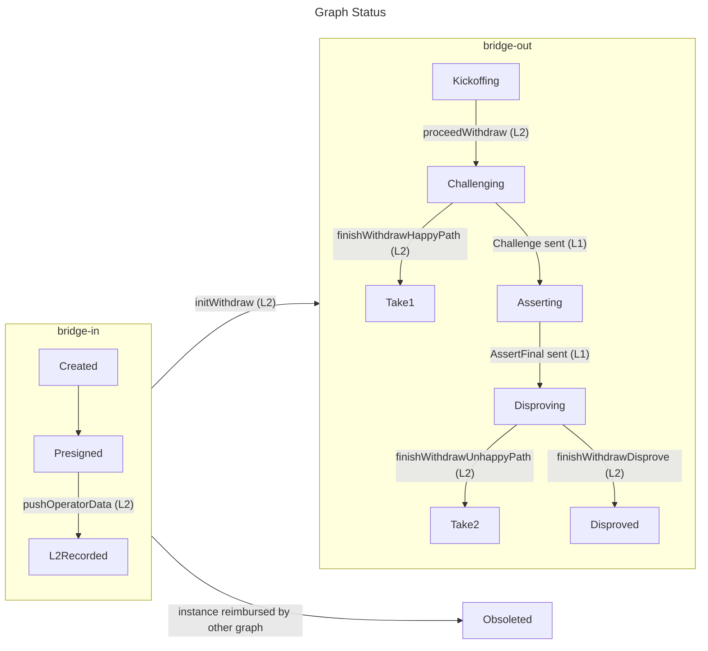

```mermaid
---
title: Graph Status
---
flowchart LR
	subgraph bridge-in
	  Created --> Presigned
	  Presigned -- pushOperatorData (L2) --> L2Recorded
  end
  bridge-in -- initWithdraw (L2) --> bridge-out
  subgraph bridge-out
	  Kickoffing -- proceedWithdraw (L2) --> Challenging
	  Challenging -- finishWithdrawHappyPath (L2) --> Take1
	  Challenging -- Challenge sent (L1) --> Asserting
	  Asserting -- AssertFinal sent (L1) --> Disproving
	  Disproving -- finishWithdrawUnhappyPath (L2) --> Take2
	  Disproving -- finishWithdrawDisprove (L2) --> Disproved
  end
  bridge-in -- instance reimbursed by other graph --> Obsoleted
```